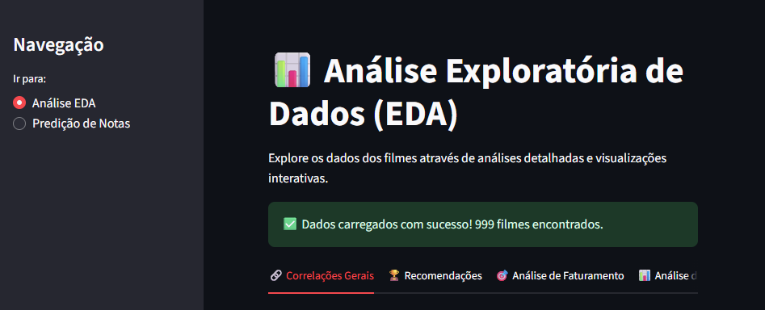
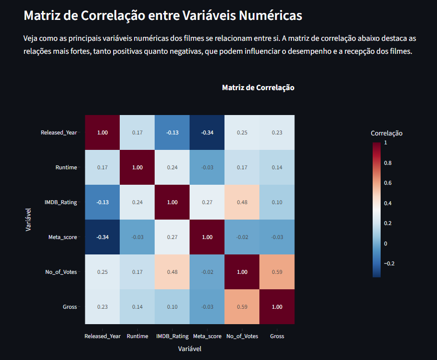
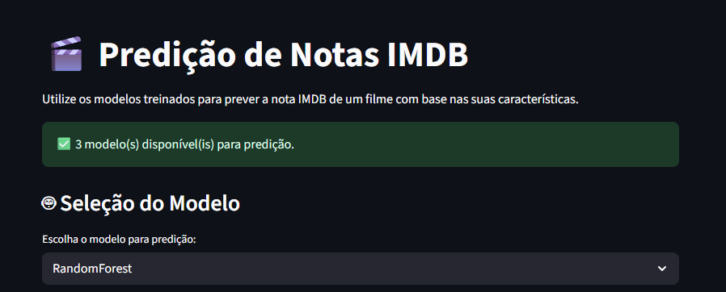
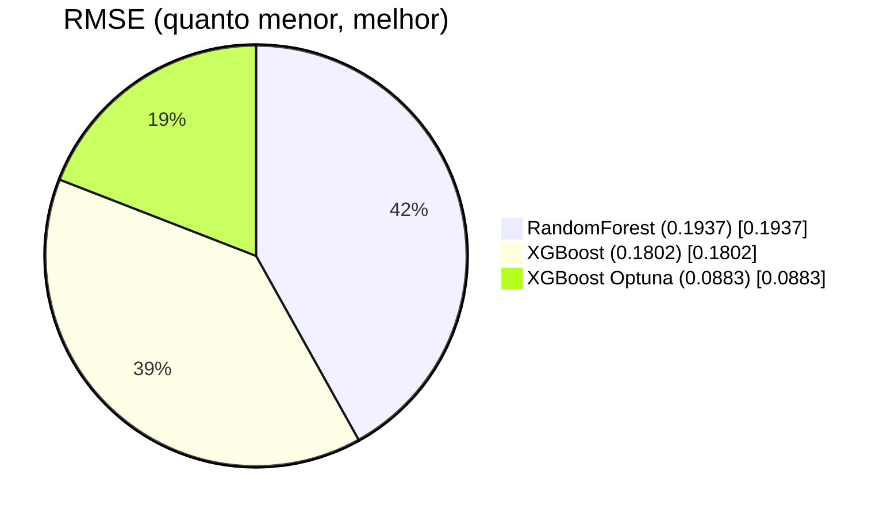
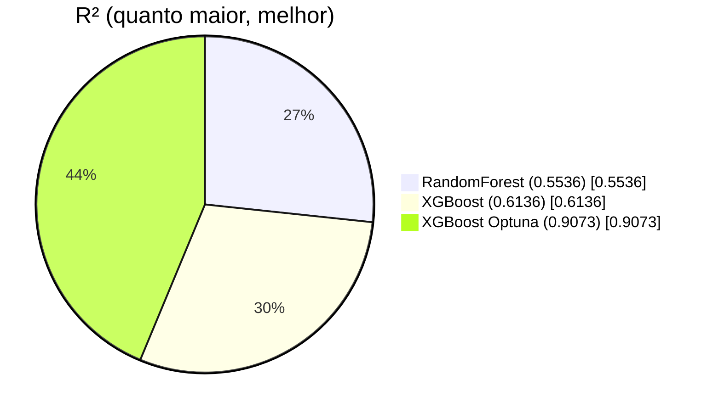
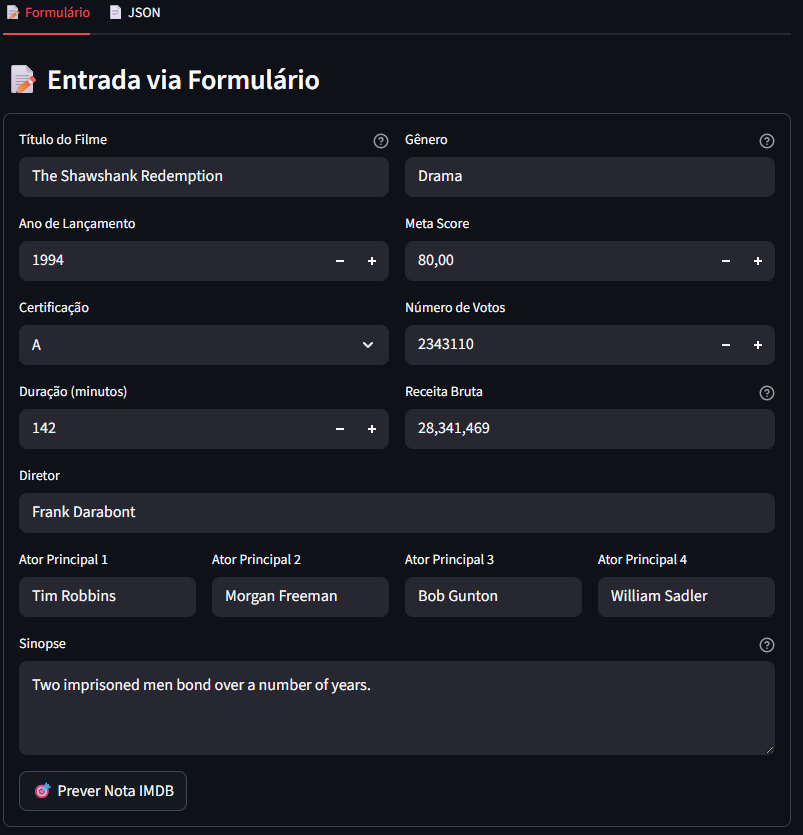
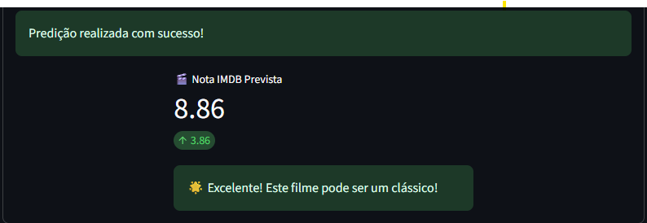
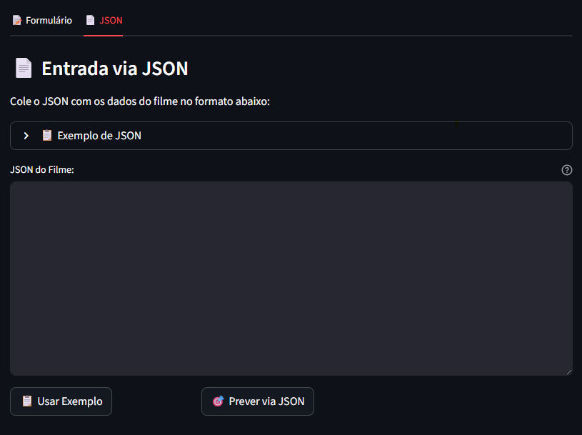

# 🎬 Projeto de Predição de Notas IMDB

Este projeto é uma aplicação de Machine Learning para predição de notas IMDB de filmes, desenvolvida com **Streamlit** e incluindo análise exploratória de dados (EDA) e três modelos de ML treinados.



## 🚀 Funcionalidades

### 📊 Análise Exploratória de Dados (EDA)

- Visualizações interativas dos dados
- Estatísticas descritivas
- Análise de correlações
- Distribuições de variáveis importantes
- Insights sobre o dataset IMDB



### 🤖 Predição de Notas IMDB

- **3 Modelos disponíveis:**
  - RandomForest
  - XGBoost
  - XGBoost com Optuna (melhor performance)
- **Duas formas de entrada:**
  - Formulário interativo
  - Upload de dados em JSON
- **Métricas de avaliação** detalhadas para cada modelo
- **Features importantes** de cada modelo
- **Interpretação automática** das predições



### 🗄️ Banco de Dados SQLite

- Armazenamento local dos dados processados
- Scripts para inicialização e população do banco
- Consultas otimizadas para análise

## 📈 Performance dos Modelos

### 📈 Comparação de Modelos




## 🛠️ Instalação e Execução

### Pré-requisitos

- Python 3.8+
- pip
- Verifique `requirements.txt`

### Configuração do Ambiente

1. **Clone o repositório:**

```bash
git clone https://github.com/Danielmadr/LH_CD_DANIEL.M.ANDRADE
cd LH_CD_DANIEL.M.ANDRADE
```

2. **Crie um ambiente virtual:**

```bash
python -m venv .venv
```

3. **Ative o ambiente virtual:**

- Windows: `.venv\Scripts\activate`
- Linux/Mac: `source .venv/bin/activate`

4. **Instale as dependências:**

```bash
pip install -r requirements.txt
```

### Executando a Aplicação

```bash
streamlit run app/main.py
```

A aplicação estará disponível em: `http://localhost:8501`

### Inicializando o Banco de Dados (Opcional)

Se desejar recriar o banco de dados:

```bash
python scripts/init_db.py --csv data/raw/desafio_indicium_imdb.csv --db data/production.db
```

## 📁 Estrutura do Projeto

```
├── app/
│   ├── main.py                 # Aplicação principal Streamlit
│   ├── EDA_Analysis.py     # Página de análise exploratória
│   └── Prediction.py       # Página de predição
├── data/
│   ├── production.db           # Banco de dados SQLite
│   └── raw/
│       └── desafio_indicium_imdb.csv  # Dataset original
├── docs/
│   └── Relatório de análises estatísticas e EDA # Relatório EDA
├── models/
│   ├── rf_model_v1.pkl           # Modelo RandomForest treinado
│   ├── xgb_model_v1.pkl          # Modelo XGBoost treinado
│   └── xgb_optuna_model_v1.pkl   # Modelo XGBoost otimizado
|── screenshots/            # Screenshots da aplicação
├── scripts/
│   ├── train_rf.py            # Script treinamento RandomForest
│   ├── train_xgb.py           # Script treinamento XGBoost
│   ├── train_xgb_optuna.py    # Script treinamento XGBoost + Optuna
│   ├── optuna_tuner.py        # Otimização de hiperparâmetros
│   ├── evaluate_models.py     # Avaliação e comparação de modelos
│   ├── predict.py             # Script de predição standalone
│   ├── preprocess.py          # Pré-processamento básico
│   ├── preprocessing.py       # Feature engineering avançado
│   ├── init_db.py             # Inicialização do banco SQLite
│   └── utils.py               # Funções utilitárias
|── config.py                  # Configuraçoes globais        
├── test_model.ipynb          # Notebook de experimentação
├── requirements              # Bibliotecas requisitos do projeto
└── README.MD                 # Este arquivo
```

## 🎯 Como Usar a Predição



### Via Formulário

1. Acesse a página "Predição de Notas"
2. Selecione o modelo desejado
3. Preencha os campos do formulário:
   - **Título do Filme**
   - **Ano de Lançamento**
   - **Certificação** (G, PG, PG-13, R, etc.)
   - **Duração** (em minutos)
   - **Gênero** (ex: Drama, Action,Adventure)
   - **Meta Score** (0-100)
   - **Número de Votos**
   - **Diretor e Atores**
   - **Sinopse**
4. Clique em "Prever Nota IMDB"



### Via JSON

1. Acesse a aba "JSON"
2. Use o exemplo fornecido ou cole seu próprio JSON
3. Clique em "Prever via JSON"



**Exemplo de JSON:**

```json
{
  "Series_Title": "The Shawshank Redemption",
  "Released_Year": 1994,
  "Certificate": "A",
  "Runtime": "142 min",
  "Genre": "Drama",
  "Overview": "Two imprisoned men bond over a number of years.",
  "Meta_score": 80.0,
  "Director": "Frank Darabont",
  "Star1": "Tim Robbins",
  "Star2": "Morgan Freeman",
  "Star3": "Bob Gunton",
  "Star4": "William Sadler",
  "No_of_Votes": 2343110,
  "Gross": "28,341,469"
}
```

## 📊 Interpretação dos Resultados

- **8.0+ :** 🌟 Excelente! Potencial clássico
- **7.0-7.9:** 👍 Muito bom! Vale a pena assistir
- **6.0-6.9:** 👌 Bom filme, mas pode não agradar a todos
- **< 6.0:** 👎 Nota baixa, possíveis problemas de qualidade


## 🛠️ Pipeline de Machine Learning

### 1. Pré-processamento

- Limpeza de dados ausentes
- Normalização de formatos
- Tratamento de outliers

### 2. Feature Engineering

- Criação de features derivadas (Movie_Age, Is_Classic, etc.)
- Transformações logarítmicas
- Encoding de variáveis categóricas
- Features de frequência para atores/diretores

### 3. Treinamento de Modelos

- **RandomForest:** Baseline robusto
- **XGBoost:** Modelo de gradient boosting
- **XGBoost + Optuna:** Otimização automática de hiperparâmetros

### 4. Avaliação

- Validação cruzada
- Métricas: RMSE, MAE, R²
- Análise de feature importance

## 🧪 Experimentos e Notebooks

O projeto inclui notebooks Jupyter para experimentação:

- `test_model.ipynb`: Experimentos com diferentes modelos e configurações
- Análise exploratória detalhada
- Testes de diferentes estratégias de feature engineering

## 📊 Scripts Standalone

### Treinamento de Modelos

```bash
# Treinar RandomForest
python scripts/train_rf.py

# Treinar XGBoost
python scripts/train_xgb.py

# Treinar XGBoost com Optuna
python scripts/train_xgb_optuna.py
```

### Avaliação de Modelos

```bash
python scripts/evaluate_models.py
```

### Predição via CLI

```bash
python scripts/predict.py models/xgb_optuna_model.pkl
```

## 🗄️ Banco de Dados

O projeto utiliza SQLite para armazenamento:

- **Tabela:** `movies`
- **Localização:** `data/production.db`
- **Estrutura:** Dados processados e prontos para ML

## 📋 Dependências Completas

```
pandas==2.3.2
numpy==2.3.2
scikit-learn==1.7.1
xgboost==3.0.5
optuna==4.5.0
streamlit==1.49.1
plotly==6.3.0
matplotlib==3.10.6
wordcloud==1.9.4
SQLAlchemy==2.0.43
```

## 🤝 Contribuição

Este projeto foi desenvolvido como parte de um desafio da Lighthouse de Data Science. Sugestões e melhorias são bem-vindas!


## 📈 Próximos Passos

- [ ] Implementar mais modelos (CatBoost, LightGBM)
- [ ] Adicionar explicabilidade com SHAP
- [ ] Monitoramento de drift de dados

## 🏆 Resultados Alcançados

- ✅ **R² = 0.9073** com XGBoost + Optuna
- ✅ **Pipeline completo** de ML
- ✅ **Documentação abrangente**
- ✅ **Código modular** e reutilizável

## 📄 Licença

Este projeto é de uso educacional e demonstrativo.

---

**⭐ Se este projeto foi útil para você, não esqueça de dar uma estrela!**
